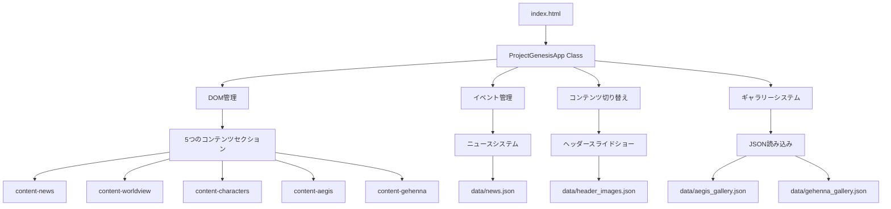
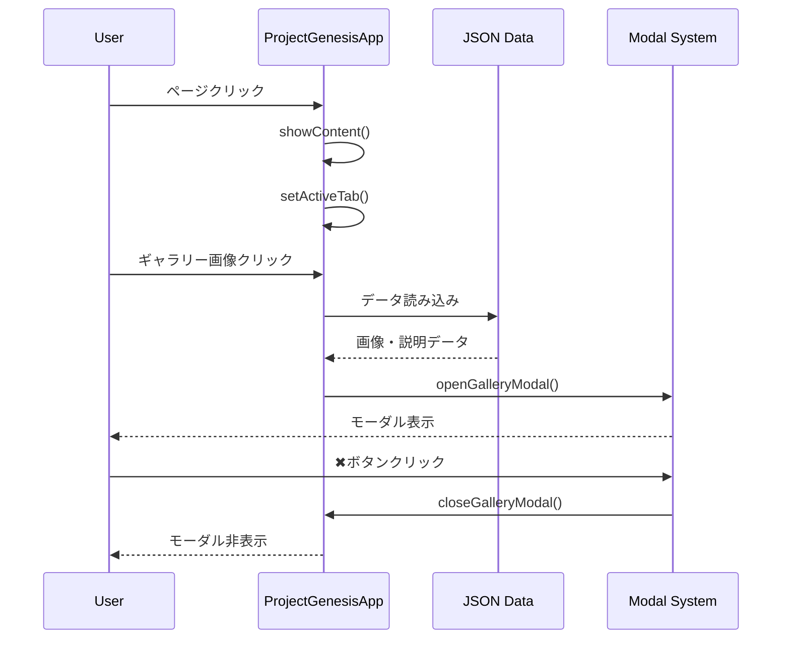
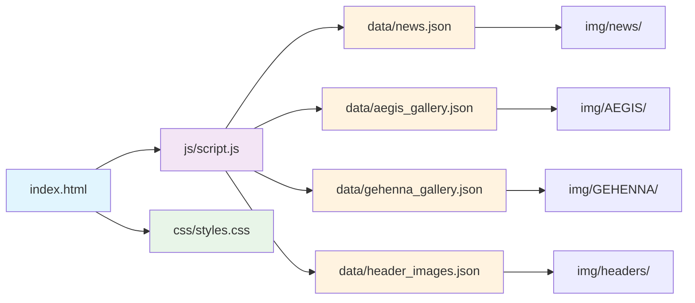

# PROJECT: GENESIS - ウェブサイト

このプロジェクトは、PROJECT: GENESISの世界観とキャラクター設定を紹介するSPA（Single Page Application）ウェブサイトです。

## 📁 **ファイル構造**

```text
shojo_webpage/
├── index.html              # メインHTMLファイル（全コンテンツ統合）
├── ARCHITECTURE.md         # プロジェクト構造詳細ドキュメント
├── css/
│   └── styles.css          # メインスタイルシート
├── js/
│   ├── script.js           # メインアプリケーションロジック
│   └── pageLoader.js       # ページローダー（未使用・旧機能）
├── data/
│   ├── news.json           # ニュースデータ
│   ├── aegis_gallery.json  # AEGISギャラリーデータ
│   ├── gehenna_gallery.json # GEHENNAギャラリーデータ
│   └── header_images.json  # ヘッダー背景画像データ
├── img/
│   ├── AEGIS/              # AEGIS関連画像
│   ├── GEHENNA/            # GEHENNA関連画像
│   └── characters/         # キャラクター画像
├── main_header/            # ヘッダー関連ファイル
└── README.md               # このファイル
```

## 🏗️ **アーキテクチャ概要**



## 🔧 **データフロー図**



## 💾 **データ構造**

### **JSONファイル形式**

#### **news.json**

```json
{
  "news": [
    {
      "id": "news_001",
      "date": "2024-01-15",
      "title": "ニュースタイトル",
      "description": "説明文",
      "image": "画像パス",
      "link": {
        "type": "internal|external",
        "url": "リンクURL",
        "target": "ターゲット"
      }
    }
  ]
}
```

#### **ギャラリーJSON (aegis_gallery.json, gehenna_gallery.json)**

```json
{
  "gallery": [
    {
      "id": "aegis_001",
      "imagePath": "img/AEGIS/worldview_001.png",
      "title": "画像タイトル",
      "description": "詳細説明",
      "category": "cityscape|facility|system|residential"
    }
  ]
}
```

#### **header_images.json**

```json
{
  "settings": {
    "fadeTransitionDuration": 1000
  },
  "headerImages": [
    {
      "path": "画像パス",
      "duration": 5000,
      "type": "background"
    }
  ]
}
```

## 🎯 **主要機能**

### **SPA コンテンツ管理**

- `showContent()`: コンテンツセクションの表示/非表示制御
- `setActiveTab()`: ナビゲーションタブのアクティブ状態管理

### **ギャラリーシステム**

- JSONベースの動的コンテンツ読み込み
- モーダル表示による詳細表示
- 左画像・右説明のレイアウト

### **ニュースシステム**

- 動的ニュース読み込み
- 内部/外部リンク対応
- エラーハンドリング

### **ヘッダースライドショー**

- 背景画像の自動切り替え
- フェードトランジション
- パフォーマンス最適化

## 🛠️ **保守・メンテナンス**

### **コンテンツ更新手順**

#### **1. ニュース追加**

```bash
# 1. data/news.json を編集
# 2. 新しいニュースオブジェクトを配列に追加
# 3. 画像があれば img/ フォルダに配置
```

#### **2. ギャラリー画像追加**

```bash
# 1. 画像を適切なフォルダに配置
#    - AEGIS: img/AEGIS/
#    - GEHENNA: img/GEHENNA/
# 2. 対応するJSONファイルを更新
#    - data/aegis_gallery.json
#    - data/gehenna_gallery.json
# 3. IDは一意になるように設定
```

#### **3. ヘッダー画像更新**

```bash
# 1. 新しい画像を img/ フォルダに配置
# 2. data/header_images.json を更新
# 3. durationで表示時間を調整（ミリ秒）
```

### **ファイル関係図**



### **開発・デバッグ**

#### **よくあるエラーと対処法**

| エラー | 原因 | 対処法 |
|--------|------|--------|
| 画像が表示されない | パスの不一致 | 相対パスを確認 |
| ギャラリーモーダルが開かない | JavaScript エラー | ブラウザコンソールを確認 |
| JSONデータが読み込まれない | ファイル形式エラー | JSON構文を検証 |

#### **デバッグコマンド**

```javascript
// ブラウザコンソールで実行
console.log(window.projectGenesisApp); // アプリ状態確認
console.log(window.projectGenesisApp.headerImagesData); // ヘッダー画像データ確認
```

### **ブランチ運用**

```mermaid
gitgraph
    commit id: "Initial"
    branch develop
    checkout develop
    commit id: "Feature A"
    commit id: "Feature B"
    checkout main
    merge develop
    commit id: "Release v1.0"
```

## 🚀 **デプロイメント**

### **GitHub Pages 設定**

1. リポジトリ設定で Pages を有効化
2. Source を "Deploy from a branch" に設定
3. Branch を "main" に設定
4. フォルダーを "/ (root)" に設定

**注意事項:**

- GitHub Pagesは静的サイトホスティングのため、サーバーサイドヘッダー設定はできません
- セキュリティヘッダー（X-Content-Type-Options等）はGitHub側で自動設定されます
- 初回デプロイ後、反映に数分かかる場合があります

### **ローカル開発環境**

```bash
# ローカルサーバー起動（Python）
python -m http.server 8000

# または Node.js
npx serve .

# アクセス
http://localhost:8000
```

## 📱 **技術仕様**

- **アーキテクチャ**: SPA (Single Page Application)
- **スタイリング**: Custom CSS（Tailwindライクなユーティリティクラス含む）
- **フォント**: Google Fonts (Noto Sans JP, Orbitron)
- **JavaScript**: Vanilla ES6+ (フレームワークなし)
- **データ形式**: JSON
- **ブラウザサポート**: Chrome, Firefox, Safari, Edge
- **デプロイ**: GitHub Pages対応（静的サイト）
- **パフォーマンス**: 画像lazy loading, ハードウェア加速対応

## 📋 **チェックリスト**

### **リリース前確認**

- [ ] 全画像ファイルが正しいパスに配置されている
- [ ] JSONファイルの構文が正しい
- [ ] すべてのリンクが機能する
- [ ] ギャラリーモーダルが正常に動作する
- [ ] モバイル表示が正しい
- [ ] ブラウザ互換性チェック完了
- [ ] GitHub Pages環境での動作確認完了
- [ ] 画像にlazy loadingが適用されている
- [ ] パフォーマンス最適化が完了している

### **定期メンテナンス**

- [ ] 月1回：画像ファイルサイズ最適化
- [ ] 月1回：JSONデータの整合性確認
- [ ] 四半期1回：ブラウザ互換性テスト
- [ ] 半年1回：依存関係更新確認

## 📞 **サポート**

### **問題報告**

- GitHub Issues を使用
- エラーの詳細とスクリーンショットを添付

### **開発者情報**

- **プロジェクト**: PROJECT: GENESIS
- **メンテナー**: PROJECT: GENESIS Committee
- **ライセンス**: © PROJECT: GENESIS Committee

---

## 📚 **関連ドキュメント**

- [ARCHITECTURE.md](./ARCHITECTURE.md) - 詳細な技術仕様
- [GitHub Pages ドキュメント](https://docs.github.com/pages)
- [Tailwind CSS ドキュメント](https://tailwindcss.com/docs)
